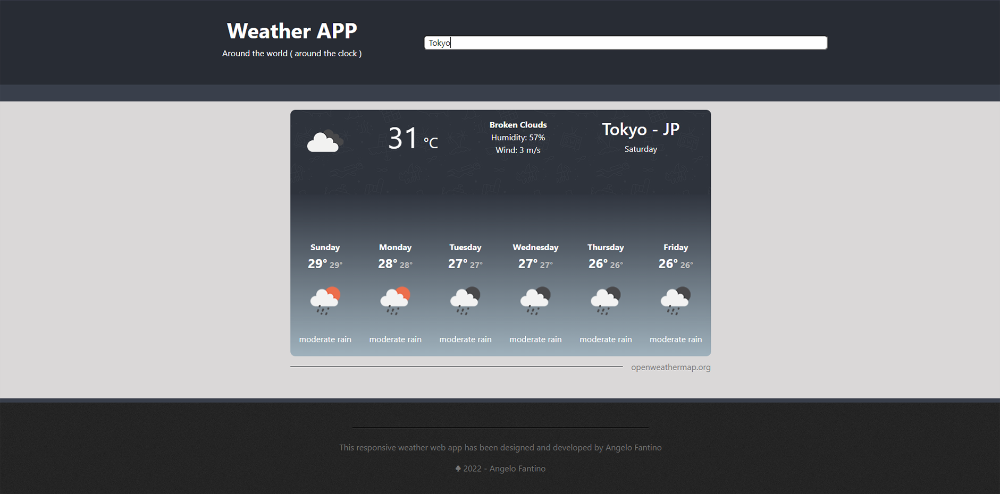

<div align="center">

# **Weather App**


</div>

<p align="justify">
    This responsive weather application fetches the weather information typed by the user and displays it on the screen. The application shows the current weather and the next six days ahead. The application was built with ReactJS and OpenWeather API.
</p>

**LIVE DEMO** - [Weather App](https://triduum-weather-app.netlify.app/)

<div align="center">



</div>

## **Table of Contents**

---

* [Features](#features)
* [Built With](#built-with)
* [Running the Application](#running-the-application)
* [Usage](#usage) 
* [Creator](#creator) 
* [Acknowledgments](#acknowledgments)
* [License](#license)

## **Features**

---

 1 - Current weather displays:
 - Weather icons
 - The temperature in celsius
 - Weather description, humidity level and wind speed 
 - The city, country, and the day of the week

2 - Forecast weather for the next 6 days ahead:
 - Days of the week
 - Maximum and minimum temperature
 - Weather icons
 - Weather description

 3 - Responsive

## **Built With**

---

- [HTML5](https://www.w3schools.com/html/) / [CSS3](https://www.w3schools.com/css/)
- [React Bootstrap - v2.5.0](https://react-bootstrap.netlify.app/) 
- [ReactJS - v18.2.0](https://reactjs.org/docs/getting-started.html) 
- [OpenWeather](https://openweathermap.org/) 
- Hosted on [Netlify](https://www.netlify.com/)

## **Running the Application**

---

<p align="justify">
    To run locally on your computer, do the following steps below:     
</p>

1. Open your terminal and type:

```bash
#This will clone the project to your machine

git clone https://github.com/angelo-fantino/weather-app.git
 ```

2. Typing `cd plus the folder name` on your terminal, you will head to the application's folder:

```bash
#You will head to the application's folder

cd w-app
```

3. Install the dependencies:

```bash
#This installs the required dependencies

npm install
```

4. To run this application, type:

```bash
#To run this project 

npm start
```
 
You can now view the project in the browser: [http://localhost:3000](http://localhost:3000)

## **Usage**

---

<p align="justify">
    At the search bar on the top of the page, type the city name you are interested in and press "Enter" from the keyboard. The current and forecast weather data will be displayed on the screen in a few seconds. 
</p>

## **Creator**

---

Angelo Fantino :: [Website](https://angelofantino.com) / [GitHub](https://github.com/angelo-fantino) ::

## **Acknowledgments**

---

I am grateful for the indirect help in this project:

[Code with Sloba](https://bobangajicsm.github.io/portfolio/) - For [Build a Weather app in React JS](https://www.youtube.com/watch?v=xBqEWbirtvA) tutorial

## **License**

---

<p align="justify">  
    This application is free software: you can redistribute it or modify it for personal or commercial usage without restriction. This license has a limitation of liability and does not provide any warranty.    
</p>
